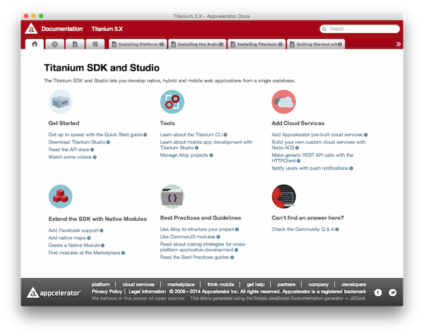

# Titanium Docs
The Appcelerator [Titanium & Alloy Documentation](http://docs.appcelerator.com/titanium/latest/) packaged as a MacOS/Windows/Linux desktop app for fast, offline access. Build using [TideSDK](http://www.tidesdk.org) and the [Continuous Builds](http://builds.appcelerator.com/#docs) of the static online documentation.

## How to install

**NOTE:** I only do MacOS myself. If you want to contribute Linux or Windows builds read *How to build* and send me the build.

### MacOS
1. Download the latest DMG from [Releases](https://github.com/FokkeZB/Titanium-Docs/releases).
2. Mount the image.
3. Drag the *Titanium Docs* app to the *Applications* folder.
4. Open *Titanium Docs* and find a nice spot for it in your dock ;)

### Linux
1. Download the latest tgz from [Releases](https://github.com/FokkeZB/Titanium-Docs/releases).
2. Unpack somewhere like `~/TiDocs/`.
3. Run the executable in the folder: `./Titanium\ Docs`.

## How to build

1. Clone or [Download](https://github.com/FokkeZB/Titanium-Docs/archive/master.zip) this repository.
2. Go to [http://builds.appcelerator.com/#docs](http://builds.appcelerator.com/#docs).
3. Download the latest *Titanium Documentation*.
4. Extract the ZIP and move the contents of the extracted directory to `Resources/docs`.
5. In [tiapp.xml](tiapp.xml) update `<version>` with the date in the ZIP filename (`2014-11-25_16-10-37`).
6. Edit `Resources/docs/latest/index.xml` and add ` style="-webkit-user-select: auto"` to the `<body>` to fix [#2](https://github.com/FokkeZB/Titanium-Docs/issues/2).
7. Follow the [TideSDK Getting Started](http://tidesdk.multipart.net/docs/user-dev/generated/#!/guide/getting_started) to setup TideSDK on a machine running the same platform you want to build the app for.
8. Import the downloaded repository as a project in *TideSDK Developer*.
9. Go to *Test & Package*.
10. Run *Package with Runtime*.
11. Use something like [Infinite](https://infinit.io) to send the compiled app found in `packages/[platform]` to [mail@fokkezb.nl](mail@fokkezb.nl) so I can add it to an existing or new release.

## Documentation copyright
© 2008—2014 Appcelerator Inc. All rights reserved. Appcelerator is a registered trademark
